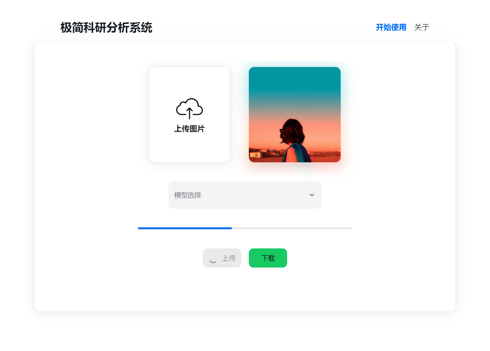
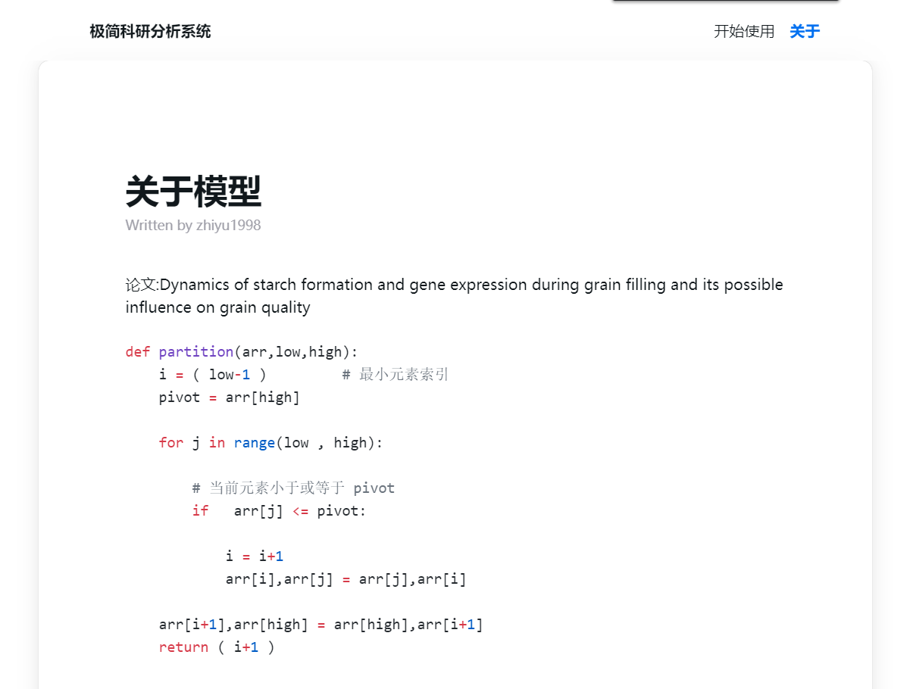
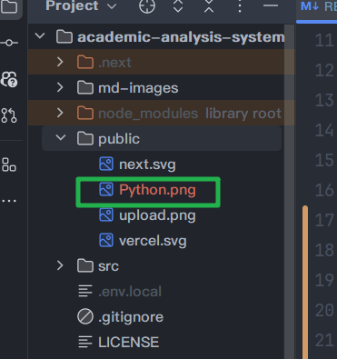
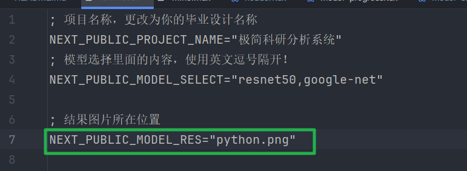
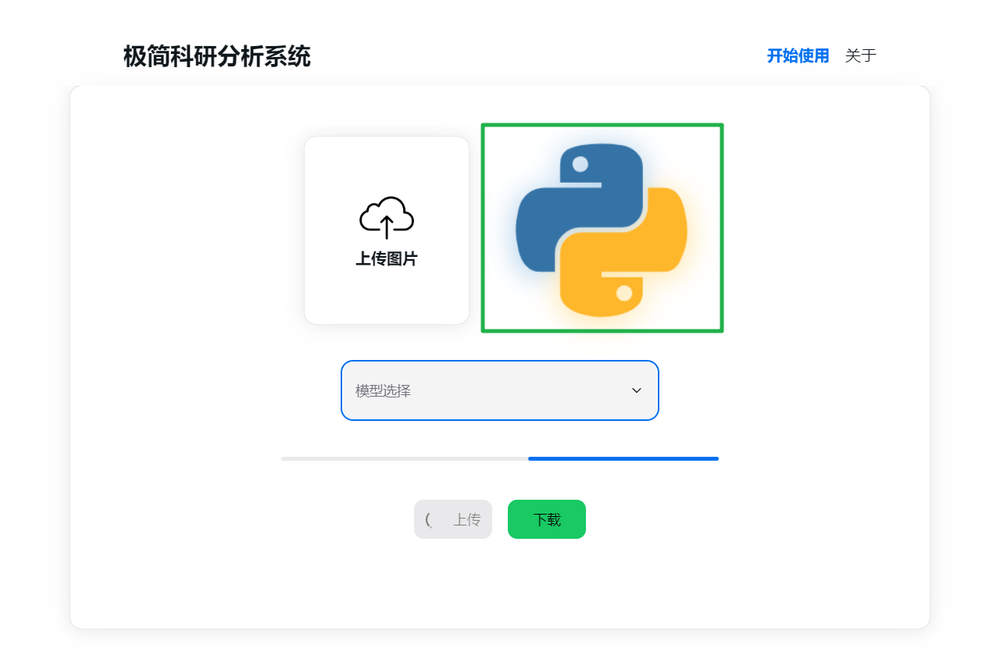
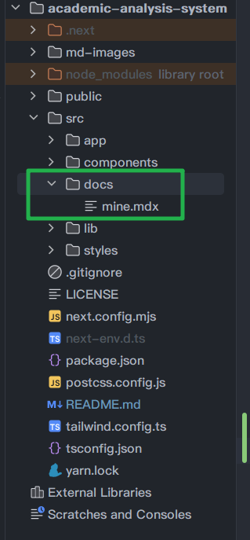
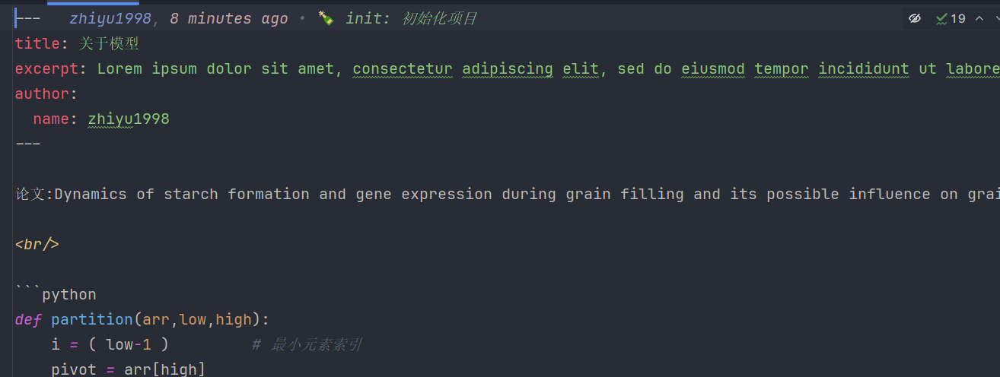
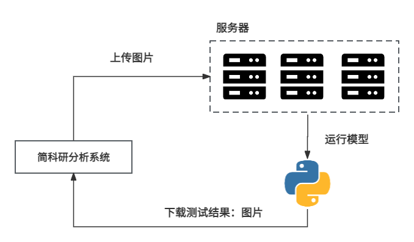

# 极简科研分析系统

🤩 仅需修改配置文件就可以展示毕业设计的图像分析、时序分析的毕设系统

- 📦 开箱即用 | 只需更改配置文件和markdown即可成为自己的毕业设计系统
- 🏠 架构简单 | 采用`Next.js + NextUI + TailwindCSS`, 整体架构便于理解


## 效果图 



## 使用指南

### 项目名称
极简科研分析系统可以更改为您的毕业设计名称，方便修改和答辩：
在项目根目录找到 `.env.local`，修改 `NEXT_PUBLIC_PROJECT_NAME`

### 模型选择
- 在项目根目录找到 `.env.local`，修改 `NEXT_PUBLIC_MODEL_SELECT`

### 结果图片
如果你不想走服务器流程知识仅仅展示，可以直接把你的效果图地址 public 文件下，然后修改 `.env.local`，修改 `NEXT_PUBLIC_MODEL_SELECT` 为你的public文件下的文件名即可
1. 放到public下



2. 修改 .env.local




### 关于
这个页面是根据markdown文件实时渲染
1. 在`src/docs`下更改 `mine.mdx` 的内容即可实时渲染`关于`界面


2. 更改自己想要的内容




## 技术栈 & 架构
- Next.js
- NextUI
- TailwindCSS
- TypeScript



## 如何安装
1. 安装依赖
```bash
yarn
```

2. 启动项目
```bash
next start
```

## 致谢
感谢以下开源项目对我Next.js的学习和对本项目的帮助:
- [someblog](https://github.com/somehq/someblog)